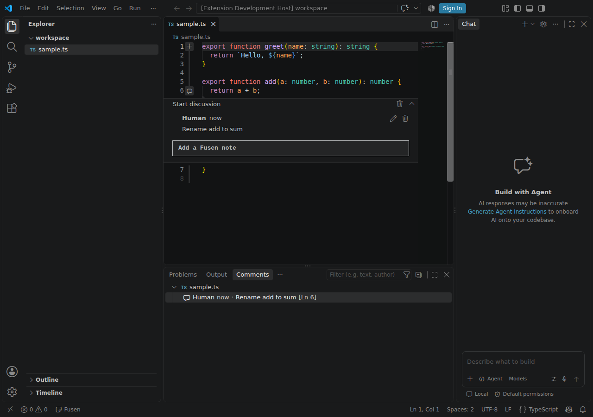
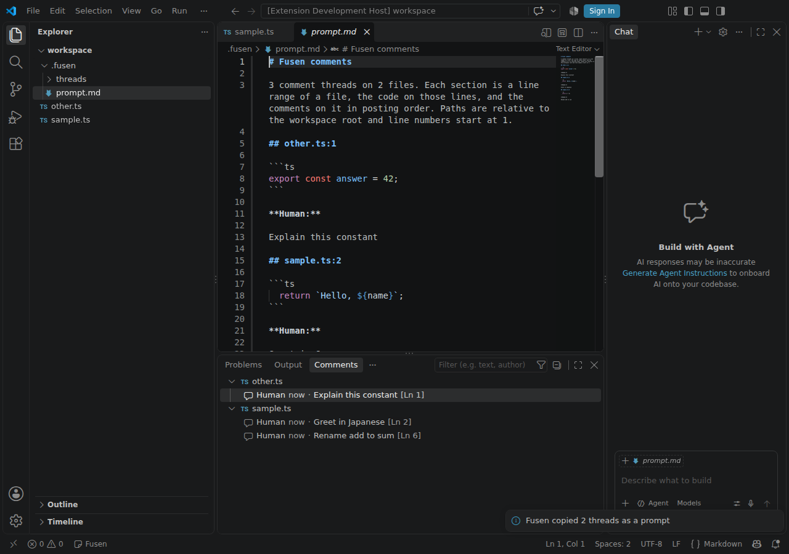
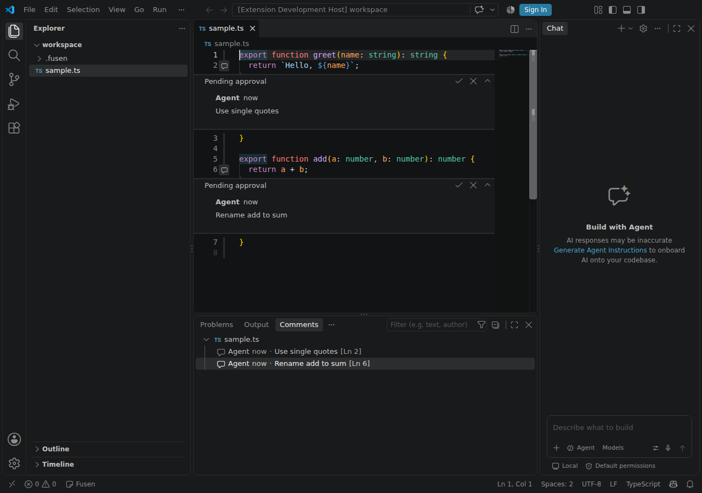
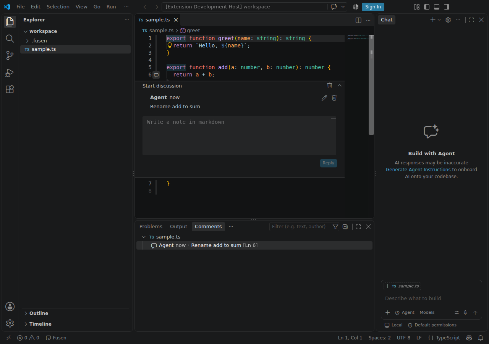

# Fusen

Sticky notes on code lines for two-way review with AI agents (VS Code extension + MCP).

Leave comments on any line of your working tree, hand them to Claude Code or Codex CLI as one prompt, and let the agents post their own comments back onto the lines — which you approve or reject in the editor.

> Status: early development. Releases: https://github.com/bannzai/fusen/releases

## Packages

| Path | What it is |
| --- | --- |
| `packages/extension` | VS Code extension (also runs in Cursor) built on the Comments API |
| `packages/mcp-server` | stdio MCP server (`fusen-mcp`) that lets AI agents read and post comments |
| `e2e` | Playwright tests that launch VS Code with the extension and capture screenshots |

## Quick setup

From a clone of this repository, with `gh` signed in and Node.js 22 or later, each target downloads the latest release into `~/.fusen` (override with `FUSEN_DIR=<dir>`) and sets it up. Run it again to upgrade.

```sh
make cursor   # install the extension into Cursor
make vscode   # install the extension into VS Code
make claude   # register the MCP server with Claude Code for every project
make codex    # register the MCP server with Codex CLI (it reads the project Codex is started in)
```

The sections below do the same by hand.

## Install the extension

Fusen is distributed only as a VSIX file, not on the VS Code Marketplace or Open VSX. Download `fusen-<version>.vsix` from a GitHub release (https://github.com/bannzai/fusen/releases):

```sh
gh release download --repo bannzai/fusen --pattern 'fusen-*.vsix'
```

To try changes that are not released yet, download the `fusen-vsix` artifact of a CI run instead (`gh run download <run-id> --repo bannzai/fusen -n fusen-vsix`).

Then install it:

```sh
code --install-extension fusen-<version>.vsix     # VS Code
cursor --install-extension fusen-<version>.vsix   # Cursor
```

To build the VSIX yourself from a clone: `npm ci && npm run build && npm run package --workspace packages/extension` (writes `packages/extension/fusen-<version>.vsix`).

## Register the MCP server

The server is one JavaScript file, `fusen-mcp.mjs`, that runs with Node.js 22 or later and needs no npm install. Download it from a GitHub release (https://github.com/bannzai/fusen/releases) and keep it where it can stay, for example `~/.fusen`:

```sh
gh release download --repo bannzai/fusen --pattern fusen-mcp.mjs --dir ~/.fusen
```

To try changes that are not released yet, download it from the `fusen-mcp` artifact of a CI run instead:

```sh
gh run download <run-id> --repo bannzai/fusen -n fusen-mcp -D ~/.fusen
```

Then register `node <absolute path of fusen-mcp.mjs>` with your agent, as shown below. To run the server from a clone instead, see "From a clone".

### Which workspace the server reads

The server reads and writes the `.fusen/` directory of one workspace folder, chosen in this order:

1. The `--workspace <path>` argument (a relative path is resolved against the working directory)
2. The `CLAUDE_PROJECT_DIR` environment variable, which Claude Code sets to the project root for the MCP servers it starts
3. The working directory the server was started in

Claude Code therefore needs no extra setting. Codex CLI does not tell the server which project it works on, so give it the project with `cwd` or `--workspace` (see below).

### Claude Code

```sh
claude mcp add fusen -- node ~/.fusen/fusen-mcp.mjs
```

Add `--scope project` to share the registration with the repository instead; it is written to `.mcp.json` at the project root:

```json
{
  "mcpServers": {
    "fusen": {
      "command": "node",
      "args": ["/absolute/path/to/fusen-mcp.mjs"]
    }
  }
}
```

### Codex CLI

Register it per project in `.codex/config.toml` at the project root (Codex CLI loads it for trusted projects), with `cwd` set to the project:

```toml
[mcp_servers.fusen]
command = "node"
args = ["/absolute/path/to/fusen-mcp.mjs"]
cwd = "/absolute/path/to/project"
```

or pass the project as an argument, which also works in `~/.codex/config.toml` or with `codex mcp add`:

```sh
codex mcp add fusen -- node ~/.fusen/fusen-mcp.mjs --workspace /absolute/path/to/project
```

```toml
[mcp_servers.fusen]
command = "node"
args = ["/absolute/path/to/fusen-mcp.mjs", "--workspace", "/absolute/path/to/project"]
```

Without either, the server uses the directory Codex CLI started it in.

### From a clone

Build the server once, then register it with its absolute path:

```sh
git clone https://github.com/bannzai/fusen
cd fusen
npm ci
npm run build
claude mcp add fusen -- node "$PWD/packages/mcp-server/dist/index.js"
codex mcp add fusen -- node "$PWD/packages/mcp-server/dist/index.js" --workspace /absolute/path/to/project
```

`packages/mcp-server/dist/index.js` is the same file as the released `fusen-mcp.mjs`, so the registrations above work with it in place of `/absolute/path/to/fusen-mcp.mjs`.

## Usage

The screenshots below are taken by the E2E tests in `e2e/tests/`.

### Add a note from the gutter

Hover over the gutter next to a line and click `+` (drag in the gutter to cover several lines), write the note in markdown and click **Add Note**. The note is saved to `.fusen/threads/` in the workspace and comes back when the workspace is opened again. Reply, edit or delete a note from its thread; the Comments panel lists every note.

Comments are shown as written by "Human" or "Agent"; set `fusen.humanName` and `fusen.agentName` in the settings to show other names.



A note stays on its code while the file changes: edits above it move it, and changes made outside the editor (a git checkout, an agent rewriting the file) are followed by finding its code again. When the code is gone, the note is labelled "Location unknown".

### Hand the notes to an agent as a prompt

Run one of these from the command palette and choose the comments in the current file or all comments:

- `Fusen: Copy comments as prompt` puts one markdown prompt on the clipboard, to paste into Claude Code or Codex CLI
- `Fusen: Export comments as prompt to .fusen/prompt.md` writes the same prompt to `.fusen/prompt.md` and opens it, so that you can tell the agent to read that file

Each section of the prompt is `<file>:<line>`, the code on those lines and the comments on it. An agent with the MCP server registered can also read the notes itself with the `list_comments` and `get_prompt` tools.



### Approve or reject the agent's comments

Once the MCP server is registered (see "Register the MCP server"), ask the agent to review your code with Fusen, for example "Review src/sample.ts and leave your comments with Fusen". Its comments arrive on their lines labelled "Pending approval". Click the check mark to approve a comment, which turns it into a regular note, or the cross to reject it, which deletes it. Nothing the agent writes becomes a note without your approval; the agent can check the outcome with `get_proposal_status`.





## Privacy

Fusen collects no data and sends nothing over the network. The extension and the MCP server only read and write files in your workspace: notes are stored in its `.fusen/` directory and nowhere else. There is no account, telemetry or analytics. Notes you hand to an AI agent, as a prompt or over MCP, go wherever that agent sends what it reads. Commit `.fusen/` to share notes through the repository, or add it to `.gitignore` to keep them local.

## Development

```sh
npm ci
npm run typecheck
npm run build
npm test
xvfb-run -a npm run test:e2e   # Linux; on macOS run `npm run test:e2e`
```

To run the E2E tests in another editor build such as Cursor, set `FUSEN_E2E_EXECUTABLE_PATH` to its executable. On Linux x64, `bash e2e/scripts/download-cursor.sh <dir>` downloads the latest stable Cursor and prints that path.

To run the E2E tests against a packaged extension instead of `packages/extension`, set `FUSEN_E2E_VSIX_PATH` to the `.vsix` file (from `npm run package --workspace packages/extension`). Each launch installs it with the editor's `--install-extension` into the test profile. This works with the Linux builds of VS Code and Cursor, which keep their command-line interface in `bin/` next to the executable.

CI (`.github/workflows/ci.yml`) runs the same commands on every pull request, runs the E2E tests in both VS Code and Cursor, once with the extension under development and once with the packaged VSIX installed, uploads their screenshots as the `e2e-screenshots`, `e2e-cursor-screenshots`, `e2e-vsix-screenshots` and `e2e-cursor-vsix-screenshots` artifacts, the packaged extension as the `fusen-vsix` artifact and the single-file MCP server as the `fusen-mcp` artifact.

Design notes: [documents/PROJECT.md](documents/PROJECT.md)

## Release

`.github/workflows/release.yml` publishes a release when a `v<version>` tag is pushed:

1. Set the same `version` in `packages/extension/package.json` and `packages/mcp-server/package.json`, and add its changes to `CHANGELOG.md`.
2. Push the tag, for example `git tag v0.1.0 && git push origin v0.1.0`. The workflow checks the versions against the tag and creates a GitHub release with the VSIX and `fusen-mcp.mjs` attached.

Running the workflow manually (`gh workflow run release.yml --ref <branch>`) is a dry run: it builds the VSIX and `fusen-mcp.mjs` without creating a release.

## License

MIT
